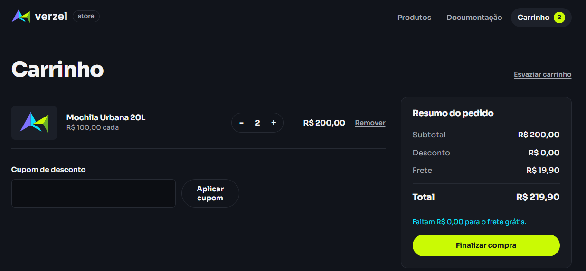
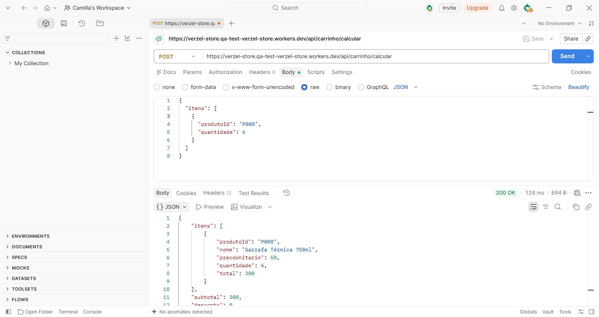
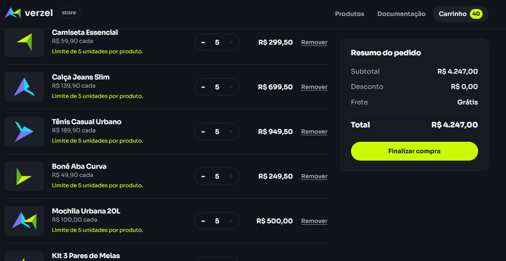

# Bugs Encontrados

## BUG-001 — Frete cobrado mesmo com subtotal de R$ 200,00

**Cenário relacionado:** CT08 — Compra de R$ 200
**Status:** Aberto

### Descrição

Ao realizar uma compra com subtotal exatamente igual a R$ 200,00 e aplicar um cupom de desconto, o sistema mantém a cobrança de frete de R$ 19,90, apesar de a documentação estabelecer que o frete deve ser grátis para subtotais maiores ou iguais a R$ 200,00.

### Pré-condições

* Produto: Mochila Urbana 20L (P005)
* Quantidade: 2 unidades
* Subtotal: R$ 200,00
* Cupom: `BEMVINDO10`

### Passos para reprodução

1. Adicionar 2 unidades da Mochila Urbana 20L ao carrinho.
2. Verificar que o subtotal é R$ 200,00.
3. Aplicar o cupom `BEMVINDO10`.
4. Verificar o valor do frete e o total da compra.

### Resultado esperado

Como o subtotal é R$ 200,00, o sistema deve aplicar frete grátis, pois a regra considera o subtotal antes do desconto.

### Resultado obtido

O sistema mantém o frete de R$ 19,90 e apresenta total de R$ 199,90 após o desconto de R$ 20,00.

O sistema também informa que faltam R$ 0,00 para o frete grátis, mas ainda mantém a cobrança do frete.

### Evidência

---

## BUG-002 — API permite mais de 5 unidades do mesmo produto

**Cenário relacionado:** CT14 — Limite de quantidade pela API
**Status:** Aberto

### Descrição

A API permite adicionar mais de 5 unidades do mesmo produto, contrariando a regra estabelecida na documentação.

A interface da loja bloqueia corretamente a sexta unidade, porém a API aceita a quantidade 6.

### Pré-condições

* Endpoint: `POST /api/carrinho/calcular`
* Produto: Garrafa Térmica 750ml (P008)
* Quantidade enviada: 6 unidades

### Passos para reprodução

1. Enviar uma requisição `POST` para `/api/carrinho/calcular`.
2. Informar o produto `P008`.
3. Definir a quantidade como `6`.
4. Verificar a resposta da API.

### Resultado esperado

A API deve rejeitar a quantidade superior a 5 unidades e retornar um erro de validação.

### Resultado obtido

A API aceitou 6 unidades e realizou o cálculo normalmente:

* Quantidade: 6
* Preço unitário: R$ 50,00
* Subtotal: R$ 300,00
* Total: R$ 300,00

Isso demonstra uma inconsistência entre a validação da interface e a validação da API.

### Evidências

**API:**

**Interface:**

